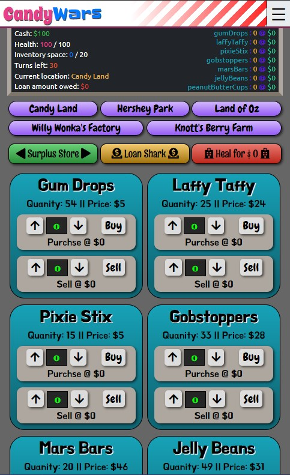

# Project Candy Wars



___

### Table of Contents

- [Project Candy Wars](#project-candy-wars)
    - [Table of Contents](#table-of-contents)
  - [Description](#description)
  - [Technologies](#technologies)
  - [How To Use](#how-to-use)
  - [Installation](#installation)
      - [API Reference](#api-reference)
  - [License](#license)

___

## Description

Just a fun little game where you can buy and sell candy between locations and try to make a profit.<br>
The game is turn based and at the end of your turns, your score is calculated and you can save your score to an arcade style score board.

## Technologies

- Mongoose / MongoDB
- React 
- Redux
- Sass / css
- Express
- Bcrypt.js
- Helmet.js
- JsonWebToken
- Node.js / npm

___

## How To Use

In order to use, open root folder in a command terminal and run command below.

``` command
npm run dev
```
Your browser should automaticly open, if it doesn't, then open browser and goto http://localhost:3000<br>


In order to play user needs to register a new account to be able to login and play.

There is an admin feature that allows an admin to see a list of registered users, and remove their accounts.

In order to create a admin account, you'll need to register with these credentials exactly.

- name:  "admin"
- email: "admin@admin"
- password: "password"

A error message will pop up in the register modal, but the admin account will be created, next to log in to the admin portal, close out the register modal, open the login modal and login with the email and password from above.

## Installation

Install node modules file, upload entire folder into VSC and run below command in a new terminal.

``` command
npm i
```

#### API Reference

```html
'NULL'
```

[Back To The Top](#project-candy-wars)

___
## License

Copyright (c) [2020] [J. McLain]

All Rights Reserved